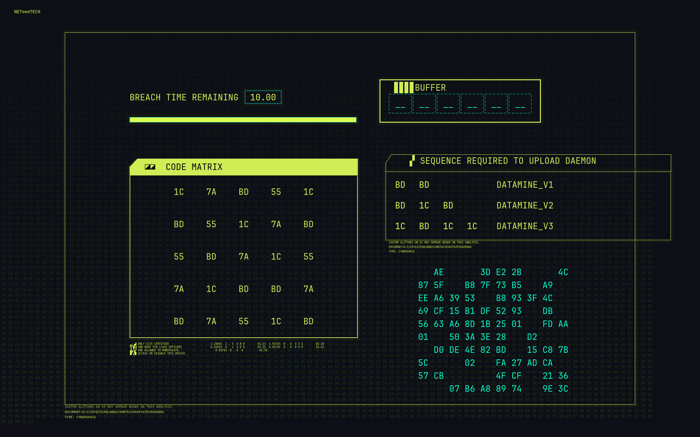

#### XBREACHPROTOCOL

xsecurelock with cyberpunk 2077 fluff

[](demo.mp4)

#### Build
```bash
./configure --with-pam-service-name=system-auth
make auth_x11_grid
```
Will build auth_x11_grid binary. Also installing via `make install` is recommended.

### Usage
```bash
XSECURELOCK_AUTH=<absolute path to auth_x11_grid> xsecurelock
```